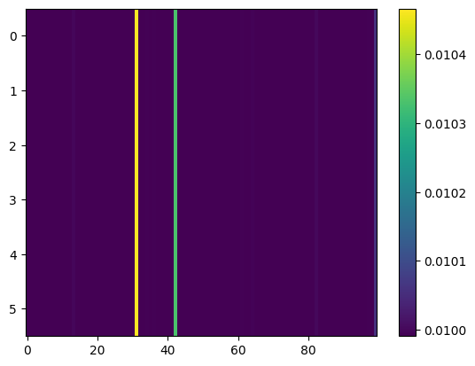

## Original settings

m = 100, K = 6, d = 2

### X

### Histogram

### Singularities for $\theta$ = $\vec 0$

[2.18460842e-03, 9.06624697e-04, 7.32567192e-04, 7.88554176e-05, 5.43194751e-05, 2.37072036e-05]

U = 

$$
\begin{pmatrix}
-0.391469 & -0.479833 & -0.552411 & -0.077249 & 0.550822 & -0.044511 \\
-0.475307 & -0.495460 & 0.685902 & 0.057439 & -0.090909 & -0.215816 \\
0.716126 & -0.636162 & 0.107474 & 0.121318 & 0.097049 & 0.216275 \\
0.179264 & -0.207894 & -0.320313 & -0.118346 & -0.454216 & -0.775710  \\
-0.142705 & -0.227050 & -0.123336 & -0.682362 & -0.481055 & 0.464586  \\
0.235582 & 0.157496 & 0.308248 & -0.704551 & 0.491107 & -0.295129  \\
\end{pmatrix}
$$

## Unchanged target magnet size (3mm), unchanged grade of magnet (N42), +1cm in workspace size

m = 100, K = 6, d = 2

### X

### Histogram

### Singularities for $\theta$ = $\vec 0$

[3.26658608e-02, 4.11075743e-03, 1.19483364e-03, 7.80053179e-04, 1.75854843e-04, 3.11631158e-05]

U = 

$$
\begin{pmatrix}
-0.487712 & -0.483759 & -0.114957 & -0.291683 & 0.251345 & 0.605513  \\
0.121153 & -0.412405 & 0.206339 & 0.598368 & -0.555283 & 0.326012  \\
-0.002440 & 0.399810 & -0.800928 & 0.269242 & -0.105894 & 0.339050  \\
-0.120837 & -0.489085 & -0.492215 & -0.239507 & -0.412694 & -0.525584  \\
-0.558677 & 0.443637 & 0.245729 & -0.260688 & -0.597748 & 0.073641 \\
0.648638 & 0.005788 & -0.008037 & -0.599219 & -0.299422 & 0.361184  \\
\end{pmatrix}
$$

## Unchanged target magnet size (3mm), and higher grade of magnet (N50), +1cm in workspace size

m = 100, K = 6, d = 2

### X

### Histogram

### Singularities for $\theta$ = $\vec 0$

[0.00464878, 0.00391892, 0.00166704, 0.00041714, 0.00024174, 0.00015484]

U = 

$$
\begin{pmatrix}
-0.549055 & 0.435065 & 0.025834 & -0.551669 & -0.057041 & -0.448327 & \\
-0.339118 & -0.429045 & 0.598209 & -0.273619 & 0.408651 & 0.318124 & \\
0.370934 & 0.464338 & 0.610845 & 0.254726 & 0.323161 & -0.323029 & \\
-0.204951 & 0.616626 & 0.069305 & 0.106593 & -0.127627 & 0.738453 & \\
-0.371834 & -0.172512 & 0.411998 & 0.463271 & -0.645413 & -0.176233 & \\
0.515441 & -0.032260 & 0.306270 & -0.574393 & -0.540806 & 0.130694 & \\
\end{pmatrix}
$$

## Increased target magnet size (5mm), and higher grade of magnet (N50), +1cm in workspace size

m = 100, K = 6, d = 2

### X

### Histogram

### Singularities for $\theta$ = $\vec 0$

[0.02071326, 0.00977409, 0.00637989, 0.00267326, 0.00100507, 0.00015481]

U = 

$$
\begin{pmatrix}
-0.223613 & 0.083131 & 0.128376 & 0.241963 & 0.768115 & 0.527314 & \\
-0.030467 & -0.073672 & -0.180292 & 0.787110 & 0.166002 & -0.560394 & \\
0.004487 & -0.241121 & 0.201941 & -0.506951 & 0.552765 & -0.581818 & \\
-0.462419 & 0.266435 & 0.790244 & 0.121971 & -0.224569 & -0.159332 & \\
-0.732104 & -0.614768 & -0.237684 & -0.054542 & -0.143267 & 0.078044 & \\
0.446365 & -0.693250 & 0.478805 & 0.216937 & -0.077052 & 0.194704 & \\
\end{pmatrix}
$$

-------

## Increased target magnet size (5mm), and higher grade of magnet (N50), +1cm in workspace size

m = 100, K = 8, d = 2

### X

### Histogram

### Singularities for $\theta$ = $\vec 0$

[0.03323993, 0.00728248, 0.00254922, 0.00162195, 0.00099895, 0.00012195]

U = 

$$
\begin{pmatrix}
0.086161 & 0.171645 & -0.583244 & 0.129025 & 0.469242 & 0.621373\\
0.114066 & 0.274425 & 0.286495 & 0.183929 & -0.639449 & 0.621993\\
0.188074 & -0.175600 & 0.599420 & -0.504974 & 0.433879 & 0.362269\\
0.906662 & -0.345323 & -0.155038 & 0.093559 & -0.126238 & -0.099950\\
0.306691 & 0.709644 & 0.316072 & 0.340910 & 0.338188 & -0.268056\\
-0.167626 & -0.491478 & 0.307417 & 0.754686 & 0.228819 & 0.118056\\
\end{pmatrix}
$$